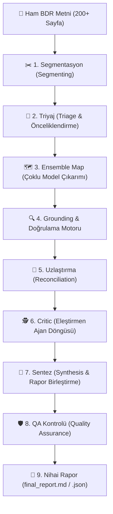

# 🏦 Finside AI — Mimari ve Çalışma Mantığı Rehberi

**Finside AI**, kurumsal Bağımsız Denetim Raporlarını (BDR), Mizan ve finansal tabloları yapay zeka modelleri ile otonom analiz eden hibrit bir karar destek sistemidir.

---

## 🎯 1. Sistem İş Akış Şeması (End-to-End Pipeline)

---

## 🧩 2. Aşama Aşama Multi-Agent Pipeline Akışı

### ✂️ 1. Segmentasyon (Segmenting)
* **Amaç:** 200+ sayfalık dev BDR raporlarını LLM `Context Window` sınırlarına takılmadan ve dipnot bütünlüğünü bozmadan mantıksal bölümlere ayırır.
* **Nasıl Çalışır?** `Dipnot X`, tablo başlıkları ve bölüm sonları tespit edilerek metin parçalara bölünür.

### 🎯 2. Triyaj (Triage)
* **Amaç:** Bölümlere ayrılan metin parçaları hızlıca taranarak kredi riski taşıma ihtimali yüksek olan kilit dipnotlar önceliklendirilir.

### 🗺️ 3. Ensemble Map (Çoklu Model Çıkarımı)
* **Amaç:** Seçilen uzman modeller (Gemini, GPT-4o, DeepSeek, Qwen vb.) eşzamanlı çalışarak kendi parçalarındaki ham risk bulgularını ve dipnot alıntılarını toplar.

### 🔍 4. Grounding (Doğrulama Motoru)
* **Amaç:** Yapay zekanın ürettiği alıntıların ham BDR metninde gerçekten var olduğunu 3 katmanlı doğrulama motoruyla (RapidFuzz + Sayısal İmza + N-Gram) teyit eder.

### 🤝 5. Uzlaştırma (Reconciliation)
* **Amaç:** Farklı modellerin çıkardığı tespitlerdeki çelişkileri giderir, aynı riski anlatan maddeleri birleştirir ve `risk_derecesi` çelişkilerinde en ihtiyatlı (yüksek) dereceyi seçer.

### 🕵️ 6. Critic (Eleştirmen Ajan Döngüsü)
* **Amaç:** İlk tarama aşamasında diğer modellerin gözden kaçırdığı veya yanlışlıkla elenen kritik dipnot risklerini yakalayan 2. geçiş denetleyici ajandır.
* **Model Seçimi:** `config.json` dosyasındaki `critic_model` parametresiyle yapılandırılır (Örn: `gpt-oss-120b`, `gpt-4o` veya `gemini-3.6-flash`).
* **Çalışma Mantığı:** 
  1. Kod seviyesinde taslağa girememiş dipnot başlıklarından bir **İpucu Listesi** çıkarılır (`_kapsanmayan`).
  2. Critic modeline ham BDR metni, taslak ve ipuçları verilerek eksik taraması yaptırılır.
  3. Critic'in bulduğu yeni maddeler `kaynak_modeller: ["critic"]` etiketiyle rapora eklenir.
  4. Yeni risk bulunduğu sürece `max_critic_turu` (varsayılan: 2 tur) sınırına kadar uzlaştırma döngüsü devam eder.

### 🧩 7. Sentez (Synthesis)
* **Amaç:** Tüm doğrulanmış riskler, finansal rasyolar ve 3-4 paragraflık kıdemli analist gerekçesi tek bir **Nihai Kredi Komitesi Raporu** halinde birleştirilir.

### 🛡️ 8. QA Kontrolü (Quality Assurance)
* **Amaç:** Kural tabanlı mantık denetimi yapılarak çelişkili komite kararları (örn: Kritik risk varken Olumlu karar verilmesi) ve eksik alanlar son kez kontrol edilir.

---

## 🏛️ 3. Bankacılık Standartlarında 5 Seviyeli Karar Sınıflandırması

Sistemimiz `KomiteKararEgilimi` veri modelinde bankacılık kredi riski yönetim standartlarına tam uyumlu 5 seviyeli karar sınıflandırmasını uygular:

| Seviye | Karar Eğilimi | Kredi Riski Şartı | Banka Tahsis Aksiyonu |
| :---: | :--- | :--- | :--- |
| 🟢 **1** | **Olumlu (Koşulsuz Tahsis)** | Riskler düşük seviyede. | Kredi doğrudan standart limit ile onaylanır. |
| 🟡 **2** | **Şartlı Olumlu (Finansal Covenant)** | Operasyonel performans iyi, rasyolarda hassasiyet var. | Kredi verilir; Net Borç/FAVÖK ve FX Hedging taahhüt şartı koşulur. |
| 🟠 **3** | **Şartlı Olumlu (Ek Teminat / Limit Kısıtlı)** | Bağlı ortaklık TRİ veya kefalet yükü yüksek. | Kredi verilir; gayrimenkul ipoteği veya limit kısıtlaması koşulur. |
| 🔵 **4** | **Askıda (Ek Denetim / Hukuki Görüş)** | Denetçi KAM veya dava karşılıklarında belirsizlik var. | Karar dondurulur; bağımsız denetçi açıklaması veya hukuki görüş istenir. |
| 🔴 **5** | **Olumsuz (Yüksek Risk / Red)** | Faaliyet sürekliliği belirsizliği veya ağır zafiyet var. | Kredi talebi reddedilir; risklerin tasfiyesi başlatılır. |
