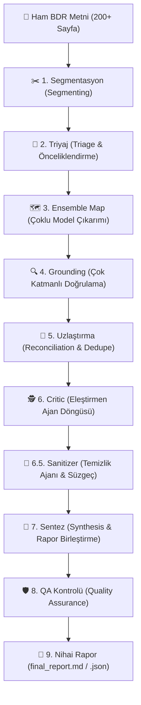

# 🏦 Finside AI — Mimari ve Teknik El Kitabı (Master Architecture)

**Finside AI**, kurumsal Bağımsız Denetim Raporlarını (BDR), Mizan ve finansal tabloları yapay zeka modelleri ile otonom analiz eden hibrit bir karar destek sistemidir.

---

## 🎯 1. Sistem İş Akış Şeması (End-to-End Pipeline)

---

## 🧩 2. Aşama Aşama Multi-Agent Pipeline Akışı

### ✂️ 1. Segmentasyon (Segmenting)
* **Amaç:** 200+ sayfalık dev BDR raporlarını LLM `Context Window` sınırlarına takılmadan ve dipnot bütünlüğünü bozmadan mantıksal bölümlere ayırır.
* **Nasıl Çalışır?** `Dipnot X`, tablo başlıkları ve bölüm sonları tespit edilerek metin parçalara bölünür.

### 🎯 2. Triyaj (Triage)
* **Amaç:** Bölümlere ayrılan metin parçaları hızlıca taranarak kredi riski taşıma ihtimali yüksek olan kilit dipnotlar önceliklendirilir.

### 🗺️ 3. Ensemble Map (Çoklu Model Çıkarımı)
* **Amaç:** Seçilen uzman modeller (Gemini, GPT-4o, DeepSeek, Qwen vb.) eşzamanlı çalışarak kendi parçalarındaki ham risk bulgularını ve dipnot alıntılarını toplar.

### 🔍 4. Grounding (Doğrulama Motoru)
* **Amaç:** Yapay zekanın ürettiği alıntıların ham BDR metninde gerçekten var olduğunu 3 katmanlı doğrulama motoruyla (RapidFuzz + Sayısal İmza + N-Gram) teyit eder.

### 🤝 5. Uzlaştırma (Reconciliation)
* **Amaç:** Farklı modellerin çıkardığı tespitlerdeki çelişkileri giderir, aynı riski anlatan maddeleri birleştirir ve `risk_derecesi` çelişkilerinde en ihtiyatlı (yüksek) dereceyi seçer.

### 🕵️ 6. Critic (Eleştirmen Ajan Döngüsü)
* **Amaç:** İlk tarama aşamasında diğer modellerin gözden kaçırdığı veya yanlışlıkla elenen kritik dipnot risklerini yakalayan 2. geçiş denetleyici ajandır.
* **Model Seçimi:** `config.json` dosyasındaki `critic_model` parametresiyle yapılandırılır (Örn: `gpt-oss-120b`, `gpt-4o` veya `gemini-3.6-flash`).
* **Çalışma Mantığı:** 
  1. Kod seviyesinde taslağa girememiş dipnot başlıklarından bir **İpucu Listesi** çıkarılır (`_kapsanmayan`).
  2. Critic modeline ham BDR metni, taslak ve ipuçları verilerek eksik taraması yaptırılır.
  3. Critic'in bulduğu yeni maddeler `kaynak_modeller: ["critic"]` etiketiyle rapora eklenir.
  4. Yeni risk bulunduğu sürece `max_critic_turu` (varsayılan: 2 tur) sınırına kadar uzlaştırma döngüsü devam eder.

### 🧹 6.5. Sanitizer (Temizlik Ajanı & Regex Süzgeci)
* **Amaç:** Jenerik etki cümlelerini ("Borç ödeme kapasitesi üzerindeki olası etki") ve risk mekanizması barındırmayan soyut/yalın bilanço kalemlerini ("Kıdem Tazminatı Yükümlülüğü") ayıklayan çift aşamalı (Regex + Hızlı LLM) filtre katmanıdır.
* **Nasıl Çalışır?**
  1. **Python Regex Süzgeci (`jenerik_ve_tekrarlayan_ele`):** Somut finansal büyüklük (% oran, TL tutar, ipotek, rehin vb.) taşımayan yüzeysel jenerik riskleri aynı kategori altındaki spesifik dipnot maddelerinin bünyesine yedirerek tekleştirir.
  2. **LLM Sanitizer Agent (`riskleri_temizle`):** Hızlı bir model (örn. `faz6.5-sanitizer`) aracılığıyla kalan jenerik etki cümlelerini somut finansal analizlerle günceller veya geçersiz maddeleri eler.

### 🧩 7. Sentez (Synthesis)
* **Amaç:** Tüm doğrulanmış riskler, finansal rasyolar ve 3-4 paragraflık kıdemli analist gerekçesi tek bir **Nihai Kredi Komitesi Raporu** halinde birleştirilir.

### 🛡️ 8. QA Kontrolü (Quality Assurance)
* **Amaç:** Kural tabanlı mantık denetimi yapılarak çelişkili komite kararları (örn: Kritik risk varken Olumlu karar verilmesi) ve eksik alanlar son kez kontrol edilir.

---

## 🔍 3. Grounding & Deduplikasyon Motoru

Grounding, yapay zekanın ürettiği alıntıların ham BDR metninde gerçekten var olduğunu doğrulayarak halüsinasyon riskini sıfırlar.

### Grounding 3 Katmanlı Doğrulama Akışı:
1. **Kanonik Normalizasyon (`_sadelestir_metin`):** Çoklu satırlar, tablar ve sayı formatları (nokta/virgül) standartlaştırılır (`"16.881.700 TL"` → `"16881700 tl"`).
2. **Katman 1 — RapidFuzz Bulanık Eşleşme:** Metin içinde kısmi oran denetlenir (Eşik: `%70+`).
3. **Katman 2 — Sayısal İmza Kümesi Denetimi (`_onemli_sayilar`):** Alıntıdaki 4+ haneli rakamlar regex ile çıkarılır ve kaynak metin penceresinde tam eşleşmesi denetlenir.
4. **Katman 3 — N-Gram Kelime Kapsamı:** Anlamsal kelime örtüşmesi %75+ ise doğrulama geçer.

### Tekilleştirme Süzgeci (Deduplication):
* **Sayısal İmza (Number Fingerprinting):** İki kalemin sayısal değerleri %80+ ortaksa başlık farkına bakılmaksızın aynı kümede birleşir.
* **Cosine Similarity & Vector Embeddings:** OpenAI Embeddings (`text-embedding-3-small`) veya yerel TF-IDF N-Gram Matrisi üzerinden metinlerin kosinüs açısı hesaplanır.
* **Dipnot Önek Temizleme Regex'i:** `_DIPNOT_PREFIX_RE` ile `Dipnot 7 - Kısa Vadeli Borçlanmalar` ve `Kısa Vadeli Borçlanmalar` aynı başlık olarak eşleştirilip tekleştirilir.

---

## 🏢 4. Veri Şemaları ve Pydantic Modelleri

Sistemde modeller arası veri transferini sağlayan temel Pydantic sınıfları:

### 1. `BDRRiskAnalysisReport` (Nihai Rapor Nesnesi)
- `firma_adi`: Analiz edilen şirketin ticari unvanı.
- `rapor_donemi`: BDR rapor dönemi (Örn: 31 Aralık 2024).
- `denetim_firmasi`: Bağımsız denetim kuruluşu (EY, PwC, Deloitte vb.).
- `denetci_gorusu`: Olumlu / Şartlı Olumlu / Olumsuz / Kaçınma.
- `tespit_edilen_riskler`: List[BDRRiskItem] (Konsolide edilmiş risk kalemleri).
- `finansal_rasyo_ozeti`: `FinansalRasyoOzeti` (Likidite, borçluluk, YP açık pozisyonu).
- `karar_egilimi`: `KomiteKararEgilimi` (5 Seviyeli Kredi Komitesi Tahsis Seviyesi kararı).
- `komite_tavsiyesi_ve_sartlar`: List[str] (Kısıtlayıcı covenant şartları).
- `analist_gerekce_metni`: 3-4 paragraflık kıdemli analist değerlendirmesi.

### 2. `FinansalRasyoOzeti` (Tipleştirilmiş Rasyo Nesnesi)
OpenAI Strict Mode ve Gemini API uyumluluğu için tipleştirilmiş özel nesnedir:
- `cari_oran`, `likidite_orani`, `kaldirac_orani`, `net_borc_favok`, `ozkaynak_orani`, `net_doviz_pozisyonu`.

---

## 🤖 5. LLM Sağlayıcıları, Limitler ve %100 Uyumluluk Motoru

Sistem, `config.py` içerisindeki `Config.PROVIDER_INPUT_LIMITS` haritasına göre sağlayıcı bazında maksimum girdi karakter sınırı uygular:

| Sağlayıcı (`provider`) | Efektif Girdi Sınırı (`PROVIDER_INPUT_LIMITS`) | Yaklaşık Context Window |
| :--- | :---: | :---: |
| **Gemini** | **3,800,000 Karakter** | 1,000,000 – 2,000,000 Token (~1M - 2M) |
| **Anthropic** | **760,000 Karakter** | 200,000 Token (~200K) |
| **OpenAI** | **480,000 Karakter** | 128,000 – 200,000 Token (~128K - 200K) |
| **HuggingFace** | **250,000 Karakter** | 70,000 – 128,000 Token |
| **Mock (Simülasyon)**| **10,000,000 Karakter** | Sınırsız |

### Sağlayıcı Bazlı Uyumluluk Motorları:
1. **OpenAI (GPT-4o, o1, o3-mini):**
   - **Strict Structured Outputs:** `additionalProperties: false` kuralına %100 uyumlu tipleştirilmiş Pydantic şemaları kullanılır.
2. **Google Gemini (Gemini 3.6 Flash, 3.1 Pro):**
   - **Payload Schema Guard:** Gemini REST API'sinde hataya yol açan parametreler temizlenir. Herhangi bir `INVALID_ARGUMENT` durumunda otomatik `application/json` moduna düşülerek rapor kesintisiz ayrıştırılır.
3. **HuggingFace & Açık Kaynak Modeller (Qwen 2.5, Llama 3.3, DeepSeek R1):**
   - **Pre-Validator Fallbacks:** Açık kaynak modellerin eksik bıraktığı alanlar Pydantic ön-doğrulayıcıları (`@field_validator(mode="before")`) ile otomatik varsayılan değerlerle tamamlanır.

---

## 🎛️ 6. Dinamik Pipeline Yapılandırması ve Varsayılan Modeller

### Pipeline Varsayılanları (`config.json`):
`config.json` dosyasındaki `pipeline` bloğu, sistemin varsayılan rol atamalarını belirler. POC/Ekonomi modunda varsayılan olarak `gpt-oss-120b` tanımlıdır. Üretim veya benchmark modunda `gemini-3.6-flash`, `gpt-4o`, `claude-sonnet-4-5` gibi modeller tanımlanabilir.

### UI Üzerinden Dinamik Rol Özelleştirme (`ui/tabs.py`):
Pipeline sabit bir yapıya mahkûm değildir. Kullanıcı arayüzündeki **"🎛️ Pipeline Ajan Rollerini Özelleştir"** expander'ı üzerinden aşağıdaki ajan rolleri oturum bazlı olarak dinamik olarak değiştirilebilir:
- **🤝 Uzlaştırma (Reconciler) Modeli:** `Config.update_pipeline_config(reconciler=...)`
- **🕵️ Eleştirmen (Critic) Modeli:** `Config.update_pipeline_config(critic=...)`
- **🧩 Sentez (Synthesis) Modeli:** `Config.update_pipeline_config(synthesis=...)`

---

## 🟢 7. Model Değerlendirme & Uygunluk Rozet Motoru (`Config.model_bdr_degerlendirmesi`)

Sistem, yüklenen BDR dosyasının karakter/token büyüklüğüne göre seçilen modelleri analiz eder ve arayüzde (`sidebar.py` ve `tabs.py`) dinamik rozetler üretir:

- **🟢 ⚡ Single Pass (İdeal & Hızlı):** BDR metni modelin Context Window sınırına sığıyor; parçalama yapmadan tek geçişte işlenir.
- **🟡 🧩 Map-Reduce (~N Parça):** BDR metni model sınırını aşıyor; N parçaya bölünerek işlenecektir.
- **🔴 🐢 Yüksek Parçalama (>4 Parça):** Metin çok büyük, yüksek parçalama süreyi uzatabilir.
- **⚠️ Rozet:** Modelin Max Output Tokens tavanı düşük (<8,000 token) veya sağlayıcı uyarısı mevcut.
- **🔑 ❌ API Key Eksik / Kullanılamaz:** `.env` dosyasında API anahtarı eksik veya model deaktif durumda.

---

## 🏛️ 8. Bankacılık Standartlarında 5 Seviyeli Karar Sınıflandırması

| Seviye | Karar Eğilimi | Kredi Riski Şartı | Banka Tahsis Aksiyonu |
| :---: | :--- | :--- | :--- |
| 🟢 **1** | **Olumlu (Koşulsuz Tahsis)** | Riskler düşük seviyede. | Kredi doğrudan standart limit ile onaylanır. |
| 🟡 **2** | **Şartlı Olumlu (Finansal Covenant)** | Operasyonel performans iyi, rasyolarda hassasiyet var. | Kredi verilir; Net Borç/FAVÖK ve FX Hedging taahhüt şartı koşulur. |
| 🟠 **3** | **Şartlı Olumlu (Ek Teminat / Limit Kısıtlı)** | Bağlı ortaklık TRİ veya kefalet yükü yüksek. | Kredi verilir; gayrimenkul ipoteği veya limit kısıtlaması koşulur. |
| 🔵 **4** | **Askıda (Ek Denetim / Hukuki Görüş)** | Denetçi KAM veya dava karşılıklarında belirsizlik var. | Karar dondurulur; bağımsız denetçi açıklaması veya hukuki görüş istenir. |
| 🔴 **5** | **Olumsuz (Yüksek Risk / Red)** | Faaliyet sürekliliği belirsizliği veya ağır zafiyet var. | Kredi talebi reddedilir; risklerin tasfiyesi başlatılır. |

