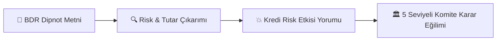

# 📢 Finside AI — Rapor Üretimi, Başlıklar ve Sunum Rehberi

Bu doküman, Finside AI tarafından üretilen rapor yapısını, çıkarılan başlıkları, risklerin kredi kararına etkisini ve **sistemin bir başkasına (yöneticiye / müşteriye / ekip arkadaşına) nasıl anlatılacağını** adım adım açıklar.

---

## 💡 1. Finside AI Birine 1 Dakikada Nasıl Anlatılır? (Executive Summary Pitch)

> *"Finside AI; bankalar ve finansal kuruluşlar için 200+ sayfalık karmaşık Bağımsız Denetim Raporlarını (BDR) ve dipnotları yapay zeka modelleriyle otomatik tarayan otonom bir Kredi Analist Sistemidir. Şirketin gizli dipnot risklerini (kur açığı, dava karşılıkları, ilişkili taraf kefaletleri, TRİ yükü) milisaniyeler içinde çıkarır, metindeki dipnotlarla doğruluğunu %100 teyit eder ve Kredi Komitesi'ne sunulmaya hazır gerekçeli bir Karar Destek Raporu üretir."*

---

## 📋 2. Üretilen Nihai Raporda Hangi Başlıklar Çıkarılır?

Sistem tarafından üretilen `final_report.md` ve `final_report.json` raporları **6 ana bölümden** oluşur:

### 1️⃣ Rapor Künyesi ve Genel Bilgiler
* **Ne İçerir?** Firma ticari unvanı, rapor dönemi, bağımsız denetim firması (EY, PwC, Deloitte vb.), denetçi görüş türü (Olumlu, Şartlı vb.) ve **Kredi Komite Karar Eğilimi**.

### 2️⃣ Risk Dağılım Paneli
* **Ne İçerir?** Rapor genelindeki toplam risk sayısı ve derecelerine göre dağılım tablosu:
  * 🔴 **Yüksek / Kritik Risk Sayısı**
  * 🟡 **Orta Risk Sayısı**
  * 🟢 **Düşük Risk Sayısı**

### 3️⃣ 📌 Section 1: Genel Kredi Risk Özeti
* **Ne İçerir?** Şirketin borç ödeme kapasitesi, likidite yapısı, döviz açık pozisyonu ve teminat durumunun üst düzey analitik özeti.

### 4️⃣ ⚠️ Section 2: Tespit Edilen Kalitatif Risk Kalemleri Detayı
Tespit edilen HER BİR risk kalemi için şu 7 kritik alan üretilir:
1. **Risk Başlığı:** Özgün dipnot numarası ve parasal tutar içeren spesifik başlık (Örn: `Dipnot 35 - 1.95 Milyar TL Net Yabancı Para Pozisyonu ve Kur Riski`).
2. **Kategori:** Ait olduğu ana TFRS kategorisi (Kur riski, TRİ, Dava, İlişkili Taraf vb.).
3. **Dipnot Referansı:** Metindeki özgün dipnot numarası (Örn: `Dipnot 21 - Taahhütler`).
4. **Risk Derecesi:** `Düşük` / `Orta` / `Yüksek` / `Kritik`.
5. **Finansal Tutar / Büyüklük:** Riskin parasal büyüklüğü (TL/USD/EUR).
6. **Risk Detayı:** Dipnotta geçen olayın özgün ayrıntıları.
7. **💥 Kredi Risk Etkisi:** Riskin şirketin nakit akışı, özkaynakları ve borç ödeme gücü üzerindeki analitik yorumu.
8. **💬 BDR Birebir Alıntısı:** Metinden alınan %100 doğrulanmış kanıt cümlesi.

### 5️⃣ 📋 Section 3: Kredi Komitesi Aksiyon & Kısıtlayıcı Şart Önerileri (Covenants)
* **Ne İçerir?** Krediyi verirken bankayı koruyacak somut şartlar:
  - *"Döviz açık pozisyonu için en az %75 oranında türev (hedging) koruması yapılması."*
  - *"Grup içi kefalet / TRİ limitlerinin dondurulması."*

### 6️⃣ 📝 Section 4: Kıdemli Analist Gerekçelendirme Metni
* **Ne İçerir?** 15+ yıllık kıdemli analist üslubuyla yazılmış, komite kararının (Olumlu, Şartlı Olumlu, Olumsuz) neden alındığını şirket bilançosu ve dipnotlarıyla gerekçelendiren 3-4 paragraflık derin finansal analiz.

---

## 🎯 3. Çıkarılan Risklerin Kredi Kararına Etkisi Nasıl Çalışır?

Risklerin kredi kararına yansıması şu 3 kademeli mantıkla gerçekleşir:

1. **Risk Tespiti:** Dipnottaki veri çıkarılır (Örn: 6.89 Milyar TL bağlı ortaklık TRİ yükü).
2. **Etki Değerlendirmesi:** Bu tutarın şirketin özkaynaklarına oranı ve nakit akışına olası tehdidi yorumlanır (Grup içi bulaşma riski).
3. **Komite Kararı:** Risklerin ağırlığına göre 5 bankacılık seviyesinden biri seçilir:
   - 🟢 **1. Olumlu:** Riskler düşük, koşulsuz kredi tahsisi.
   - 🟡 **2. Şartlı Olumlu (Covenantlı):** Finansal rasyo taahhüdü ile onay.
   - 🟠 **3. Şartlı Olumlu (Teminatlı):** Ek ipotek veya limit kısıtlaması ile onay.
   - 🔵 **4. Askıda:** Ek denetim/hukuki mütalaa bekleniyor.
   - 🔴 **5. Olumsuz:** Yüksek risk, başvuru reddi.
