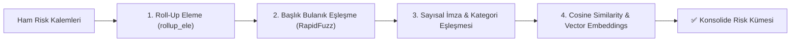

# 🔍 Grounding & Deduplikasyon Motoru Detaylı Rehberi

Bu doküman, Finside AI içinde doğruluğu garantileyen ve tekrarları temizleyen algoritmaları anlatır.

---

## 🔍 1. Grounding (Çok Katmanlı Doğrulama Motoru)

Grounding, yapay zekanın ürettiği alıntıların ham BDR metninde gerçekten var olduğunu doğrulayarak halüsinasyon riskini sıfırlar.

### Algoritma Akışı:
1. **Kanonik Normalizasyon (`_sadelestir_metin`):** 
   - Çoklu satırlar, tablar ve fazla boşluklar teke indirilir.
   - Sayılardaki binlik/ondalık ayraçları (nokta ve virgül) temizlenir: `"16.881.700 TL"` → `"16881700 tl"`.
2. **Katman 1 — RapidFuzz Bulanık Eşleşme:** Metin içinde kısmi oran denetlenir (Eşik: `%70+`).
3. **Katman 2 — Sayısal İmza Kümesi Denetimi (`_onemli_sayilar`):**
   - Alıntıdaki 4+ haneli tüm rakamlar regex ile çıkarılır.
   - Bu rakamlar kaynak metin penceresinde tam olarak bulunuyorsa ve kelimelerin en az %55'i geçiyorsa, yazım varyasyonlarına bakılmaksızın doğrulandı sayılır.
4. **Katman 3 — N-Gram Kelime Kapsamı:** Anlamsal kelime örtüşmesi %75+ ise doğrulama geçer.

---

## 🧹 2. Deduplikasyon (Tekilleştirme & Kosinüs Benzerliği)

Tekilleştirme işlemi 4 aşamalı bir süzgeçten geçer:

### Öne Çıkan Özellikler:
* **Sayısal İmza (Number Fingerprinting):** İki kalemin sayısal değerleri %80+ ortaksa başlık farkına bakılmaksızın aynı kümede birleşir.
* **Cosine Similarity:** OpenAI Embeddings (`text-embedding-3-small`) veya yerel TF-IDF N-Gram Matrisi üzerinden metinlerin kosinüs açısı hesaplanır (`_cosine`).
* **Post-Hoc Deterministik Guard:** Reconciler LLM çıktısı üretildikten sonra, başka maddelerin birleşimi olan yapay özet kalemler kod seviyesinde elenir.
